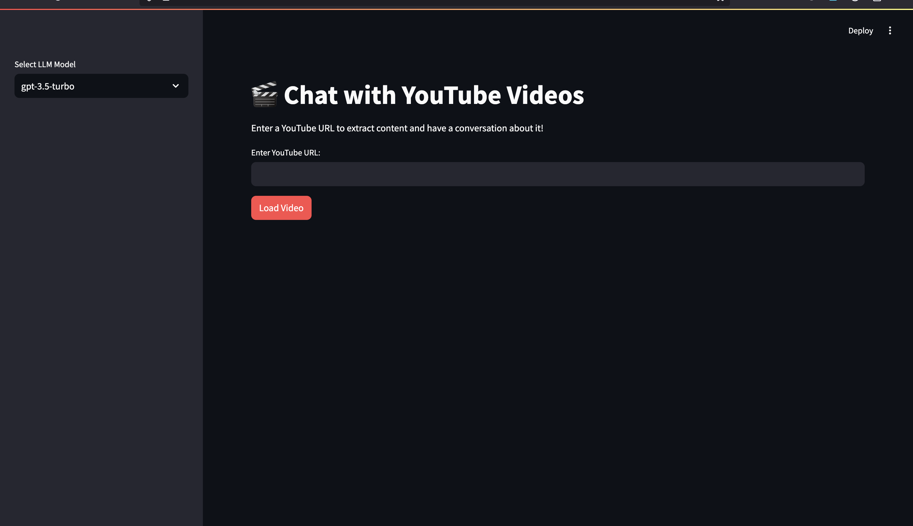

# YouTube Video Chatbot



🚀 **YouTube Video Chatbot** is a web-based application that allows users to chat about YouTube videos using an interactive UI powered by **Streamlit** and **ChatGPT**. Users can ask questions, get summaries, and extract key insights from video transcripts.

## 🔥 Features
- 🗣️ **Chat with YouTube videos** – Ask questions and get AI-powered responses.
- 📜 **Summarize videos** – Get concise summaries of YouTube content.
- 🔍 **Extract key takeaways** – Identify the most important points in a video.
- ⚡ **Fast & Easy to Use** – Built with Streamlit for a seamless experience.

## 🛠️ Tech Stack
- **ChatGPT** – For natural language processing and intelligent responses.
- **Streamlit** – For an intuitive and interactive web UI.
- **YouTube API** – For fetching video transcripts and metadata.

## 🚀 Getting Started
### Prerequisites
Ensure you have the following installed:
- Python 3.8+
- Pip
- OpenAI API Key

### Installation
1. **Clone the repository**:
   ```sh
   git clone https://github.com/yourusername/youtube-chatbot.git
   cd youtube-chatbot
   ```

2. **Set up environment variables**:
   Create a `.env` file and add your API keys:
   ```
   OPENAI_API_KEY=your_openai_api_key
   YOUTUBE_API_KEY=your_youtube_api_key
   ```

3. **Run the application**:
   ```sh
   streamlit run app.py
   ```

## 📌 Usage
1. Enter a YouTube video URL in the input field.
2. Ask questions or request a summary.
3. Get AI-powered responses in real time!

## 🤝 Contributing
Contributions are welcome! Feel free to fork the repository and submit a pull request.

## 📜 License
This project is licensed under the MIT License.

## 📬 Contact
For any inquiries or feedback, reach out via LinkedIn @Sam Elegure or open an issue in the repository!

---
### ⭐ Don't forget to give a star if you find this useful!

